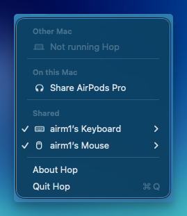

<p align="center">
  
</p>

<h1 align="center">Hop</h1>

<p align="center">
  Move a keyboard, mouse, or headphones from one Mac to the other.
</p>

<p align="center">
  
</p>

Hop sits in the menu bar. Your devices stay paired to both Macs. Hop only moves which Mac they are connected to.

The two Macs already know each other. Same Apple Account, same network, devices already paired in Bluetooth. Hop does not introduce them.

## Install

Apple silicon, macOS 11 or later. Use the same version on both Macs.

1. Download the latest zip from [Releases](https://github.com/halilatilla/hop/releases).
2. Unzip it and move Hop into Applications.
3. Open Hop. If macOS says it could not verify the app, go to **System Settings → Privacy & Security** and click **Open Anyway**.

If that button is not there, run this in Terminal, then open Hop:

```sh
xattr -dr com.apple.quarantine /Applications/Hop.app
```

Quit the old Hop from its menu before you open the new one.

## First time

Open Hop on both Macs. Each menu shows the same short code. Choose **Codes match** when the codes are the same. Hop remembers that Mac after that.

Pair each device once in **System Settings → Bluetooth**, on both Macs. Hop does not ask you to pair again.

macOS will ask for Bluetooth access, and for the local network when the two Macs find each other.

## Move a device

On the Mac that has the device, choose **Share**. Both menus then list it under **Shared**.

A checkmark means this Mac is using it. On the other Mac, choose **Connect**.

**Remove** is inside the checkmark’s row. That takes the device off the shared list and leaves it connected here.

**Other Mac** is the other computer’s name. When that Mac is not running Hop, the line says **Not running Hop**.

The menu bar itself is just the icon. It reads **Allow** while a new Mac is waiting, and **…** while a device is connecting.

## If a move does not finish

Hop asks the other Mac before anything disconnects. If that Mac does not answer, the device stays where it is. If it does leave and the other Mac does not connect it, Hop puts it back.

The other Mac needs to be awake, on the same network, and running Hop.

## Build

[Xcode](https://developer.apple.com/xcode/) and the command line tools. Rust 1.98.1, from `rust-toolchain.toml`.

```sh
xcode-select --install
cargo run --release
```

The first build compiles GPUI from the Zed repository. This repo does not fork Zed.

Hop keeps the shared list in `~/Library/Application Support/Hop`. Set `HOP_CONFIG_DIR` to use another folder.
